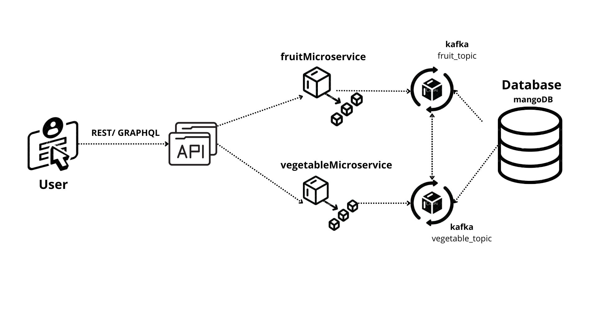

# Microservice Architecture with Node.js, REST, GraphQL, Kafka

This project is a simple skeleton code for microservice architecture using Node.js, REST, GraphQL, MongoDB and Kafka. Thanks to Mr. Gontara Salah for the inspiration and knowledge in setting up this project.



## Technologies

- **gRPC**: Used for efficient communication between microservices.
- **GraphQL**: Implemented for flexible and efficient querying of data.
- **REST**: RESTful APIs are used for exposing the services to external clients.

## Fruit Microservice

Contains API related to creating a new fruit entry and API endpoints to get the fruit data.

### REST:

```http
GET /fruits
```
### GraphQL:
```graphql
query {
  fruits {
    id
    name
    quantity
    prix
  }
}
```
### REST:
```http
  POST /fruits
```
| Parameter   | Type     | Description                       |
| :-----------| :------- | :-------------------------------- |
| `name`      | `string` | **Required**.                     |
| `quantity`  | `string` | **Required**.                     |
| `prix`      | `string` | **Required**.                     |

## Vegetable Microservice


Contains API related to creating a new vegetable entry and API endpoints to get the vegetable data.
### REST:

```http
GET /vegetables
```
### GraphQL:
```graphql
query {
  vegetables {
    id
    name
    quantity
    prix
  }
}
```
### REST:
```http
  POST /fruits
```
| Parameter   | Type     | Description                       |
| :-----------| :------- | :-------------------------------- |
| `name`      | `string` | **Required**.                     |
| `quantity`  | `string` | **Required**.                     |
| `prix`      | `string` | **Required**.                     |

# Run

To start the ApiGateway server, run the following

`node apiGerway.js`

To start the User server, run the following


`node fruitMicroservice.js`

To start the Order server, run the following


`node vegetableMicroservice.js`
